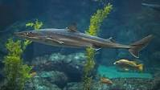
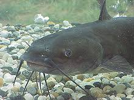
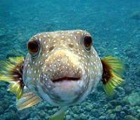

## Albert Nissim
## February 2018
## Assignment 5

Water Creatures
=======
# Brief Fish Intro
Unlike mammals, fish are cold-blooded. This means that they do not maintain a constant internal body temperature; instead, their temperature is greatly influenced by their environment. True fish have a backbone and fins. Most also breathe with gills and have scales that cover their bodies.

## Dog water thing

The spiny dogfish, spurdog, mud shark, or piked dogfish (Squalus acanthias) is one of the best known species of the Squalidae (dogfish) family of sharks, which is part of the Squaliformes order. While these common names may apply to several species, Squalus acanthias is distinguished by having two spines (one anterior to each dorsal fin) and lacks an anal fin. It is found mostly in shallow waters and further offshore in most parts of the world, especially in temperate waters. Spiny dogfish in the northern Pacific Ocean have recently been reevaluated and found to constitute a separate species, now known as "Pacific spiny dogfish", Squalus suckleyi.[2]

## Cat Water Thing

Catfish (or catfishes; order Siluriformes or Nematognathi) are a diverse group of ray-finned fish. Named for their prominent barbels, which resemble a cat's whiskers, catfish range in size and behavior from the three largest species, the Mekong giant catfish from Southeast Asia, the wels catfish of Eurasia and the piraíba of South America, to detritivores (species that eat dead material on the bottom), and even to a tiny parasitic species commonly called the candiru, Vandellia cirrhosa. There are armour-plated types and there are also naked types, neither having scales. Despite their name, not all catfish have prominent barbel. Members of the Siluriformes order are defined by features of the skull and swimbladder. Catfish are of considerable commercial importance; many of the larger species are farmed or fished for food. Many of the smaller species, particularly the genus Corydoras, are important in the aquarium hobby. Many catfish are nocturnal,[3][4] but others (many Auchenipteridae) are crepuscular or diurnal (most Loricariidae or Callichthyidae for example).

## Puff Fish Guy

The Tetraodontidae are a family of primarily marine and estuarine fish of the order Tetraodontiformes. The family includes many familiar species which are variously called pufferfish, puffers, balloonfish, blowfish, blowies, bubblefish, globefish, swellfish, toadfish, toadies, honey toads, sugar toads, and sea squab.[1] They are morphologically similar to the closely related porcupinefish, which have large external spines (unlike the thinner, hidden spines of the Tetraodontidae, which are only visible when the fish has puffed up). The scientific name refers to the four large teeth, fused into an upper and lower plate, which are used for crushing the shells of crustaceans and mollusks, their natural prey.
The majority of pufferfish species are toxic and some are among the most poisonous vertebrates in the world. In certain species, the internal organs, such as liver, and sometimes their skin, contain tetrodotoxin and are highly toxic to most animals when eaten; nevertheless, the meat of some species is considered a delicacy in Japan (as 河豚, pronounced as fugu), Korea (as 복 bok or 복어 bogeo), and China (as 河豚 hétún) when prepared by specially trained chefs who know which part is safe to eat and in what quantity. Other pufferfish species with nontoxic flesh, such as the northern puffer, Sphoeroides maculatus, of Chesapeake Bay,[4] are considered a delicacy elsewhere.[5]
The species Torquigener albomaculosus was called by David Attenborough "the greatest artist of the animal kingdom" due to the male's ability to create the most complex and visually appealing structures in the sand ever authored by animal.[6]

